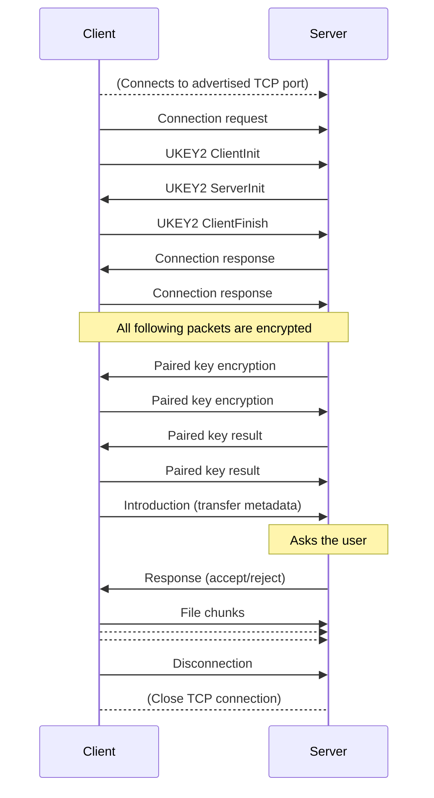

# Google's Nearby Share protocol

This document describes the Nearby Share protocol as understood by me (@grishka) from Chromium sources (that are way too convoluted) and decompiled Google Services Framework apk (that, despite being a decompilation of obfuscated code, is still more helpful than Chromium sources).

The protocol is peer-to-peer, end-to-end encrypted. Overall, it appears like it was mostly designed to run over an unreliable medium like UDP, but I've only observed it over TCP.

Only the WiFi LAN protocol is described here because that's what I reverse engineered, but the data running over other mediums (Bluetooth, WiFi Direct, ...) is most probably largely the same.

If you want to build your own Nearby Share *thing*, you will need:

1. An implementation of multicast DNS (most modern OSes have it built-in)
2. A cryptography library that is capable of ECDSA key exchange, AES-CBC, HMAC, and SHA256. OpenSSL will do but is definitely an overkill.
3. A Protobuf library
4. [These Protobuf files](/NearbyShare/ProtobufSource) I collected from the Chromium sources so you don't have to

It is also very helpful to read logcat on your Android device if you're having any trouble. The logging of the Android implementation of Nearby Share is very verbose.

### Device roles

Since a file transfer is unidirectional, the peers are assigned roles:

* The receiving side is the **server**. It listens on a TCP port and advertises an MDNS service.
* The sending side is the **client**. It discovers the MDNS service and connects to the server's TCP port.

### How devices find each other

To become visible in the sheet on Android devices, a *server* advertises an MDNS service. The **domain** is empty. The **type** is `_FC9F5ED42C8A._tcp.`. The **port** is an arbitrary TCP port on which the server accepts incoming connections.

The **name** is the following 10 bytes encoded in URL-safe base64:

* `0x23`, Google calls this "PCP" but I have no idea what it is
* 4-byte **endpoint ID**
* 3-byte **service ID**: `0xFC, 0x9F, 0x5E`
* 2 zero bytes that serve an unknown purpose

The **endpoint ID** is 4 random alphanumeric characters. It identifies devices to each other. Android uses it in its logs quite extensively.

The service also needs to have a TXT record with key `n` and the value of the following encoded in URL-safe base64 ("endpoint info"):

* 1 byte: bit field
	* 3 bits: version, set to 1 or 0, doesn't seem to make a difference
	* 1 bit: visibility, 0 = visible
	* 3 bits: device type. Android uses this to pick an icon. 0 = unknown, 1 = phone, 2 = tablet, 3 = laptop, 4 = car, 5 = foldable phone, 6 = XR device
	* 1 bit: reserved, set to 0
* 16 bytes that are somehow related to device identification. Probably meaningless without talking to Google servers. It's ok to make them random.
    * 2 bytes: salt, "Random bytes that were used as salt during encryption of public certificate metadata"
    * 14 bytes: encrypted metadata key, "An encrypted symmetric key that was used to encrypt public certificate metadata, including an account identifier signifying the remote device. The key can be decrypted using |salt| and the corresponding public certificate's secret/authenticity key."
* User-visible device name in UTF-8, prefixed with 1-byte length. Only present if the visibility bit in the first byte is 0.
* Optional TLV records. Each: 1 byte type, 1 byte length, length bytes value. Possible types:
    * 1: QR code data. See below.
    * 2: vendor ID. 1 byte, not sure what this is for. 0 = "none", 1 = Samsung.

Android does not advertise the MDNS service all the time regardless of the visibility setting. It waits for a BLE advertisement with the following parameters:

* Service UUID = `fe 2c`
* Service data = `fc 12 8e 01 42 00 00 00 00 00 00 00 00 00 [10 random bytes]`

This can't be sent from macOS because there's no API I could find that would allow setting the service data. As far as I can tell, the Android side is hardcoded to look for that prefix in the service data so there really is no way to make it work on macOS. Android sends these BLE advertisements periodically while searching for Nearby Share targets; these are also what makes the "device nearby is sharing" notification pop up.

The service ID (FC9F...) comes from SHA256("NearbySharing") = `fc9f5ed42c8a5e9e94684076ef3bf938a809c60ad354992b0435aebbdc58b97b`.

#### QR codes

The sending device can generate a QR code to be scanned by the receiving device. This bypasses the need to send BLE broadcasts. The QR code contains a URL of the form

```
https://quickshare.google/qrcode#key=XXX
```
Where XXX is the ECDSA public key of the sending device, in the "compressed" format (i.e. just the X value) prefixed with a 2-byte version number of 0 and *another* 1-byte version of 2 or 3, and encoded in URL-safe base64. This public key doesn't have to match the one used later in the connection — this can be a separate key pair just for the QR code.

Both devices need to derive two keys from this `key` parameter (after decoding the base64, but still including the version numbers):
* The **advertising token**: HKDF-SHA256(IKM = `key` parameter, salt is empty, info = `advertisingContext`, output length = 16)
* The **name encryption key**: HKDF-SHA256(IKM = `key` parameter, salt is empty, info = `encryptionKey`, output length = 16)

When the receiving device scans the code (or, more precisely, when the activity handling that URL launches), it starts advertising its MDNS service. A "QR code" (type 1) TLV record is added to the endpoint info. The contents of that record depend on the visibility setting on the receiving device.

If the device is **visible**, the TLV record simply contains the *advertising token* as-is.

If the device is **hidden**, the visibility bit will be set to 1, there will be no name in plain text, and the TLV record will contain the name encrypted using AES-GCM. The format is: 12 bytes initialization vector, then encrypted data itself, then 16 bytes authentication tag. The key is the *name encryption key*, the additional data for authentication is the *advertising token*.

While the QR code is displayed, the sender will check each device it finds to see if it matches either of these conditions. The way it is implemented in GMS, it would first compare the TLV record with the *advertising token*, and if it doesn't match, try to decrypt it. As soon as a matching device is found, the sender will connect to it automatically.

To skip the user prompt, the `qr_code_handshake_data` inside the `PairedKeyEncryptionFrame` sent by the sending device must be an ECDSA signature of the UKEY2 auth key (the same one used to derive the connection PIN) made with the private key that corresponds to the public key used in the QR code. The signature is in the "IEEE P1363" format, i.e. just the `R` and `S` values concatenated together, for a total of 64 bytes. TODO: figure out why this sometimes fails and the prompt still appears.

### High-level diagram



From the Google point of view, the "Nearby connections" part is a separate universal transport layer, over which the "Share" runs. This may explain some bizarre arrangements where you have protobuf inside protobuf inside encrypted protobuf inside protobuf.

### Frame/packet/message types

There are three types of packets that can appear directly ~~on the wire~~ in the air:

1. **Offline frames.** These are the basic uint of the nearby protocol. They are used to control the connection.
2. **UKEY2 messages.** These are used for the encryption key exchange (UKEY2 is Google's bespoke algorithm for that).
3. **Secure messages.** These are used exclusively after the initial negotiation and carry other packets inside them in the encrypted form.

Keep the protobuf files open to follow along.

### TCP framing

Each protobuf message sent over the TCP connection is prefixed with 4-byte big-endian (MSB first) length.

### Initial handshake & key exchange

(described from the server/recipient point of view)

After the client connects to the server, it sends two packets: a "connection request" and a "UKEY2 client init".

#### Connection request

This is a subtype of "offline frame".
The client wants to connect to the server and tells it about itself. The only field of interest here is `endpointInfo`. It contains the device type and name. It has the same format as the `n` TXT record described above, just without the base64 encoding.

#### UKEY2 client init

This is a subtype of "UKEY2 message". Google's UKEY2 reference implementation [is open source](https://github.com/google/ukey2) and comes with documentation. Please refer to that repo for details on the key exchange.
This is the initial step of the key exchange for end-to-end encryption. Upon receiving this, the server generates a ECDSA key pair and sends its public key in a "server init". The server also needs to remember the raw serialized client init message for the final key derivation step. The outgoing server init message is also needed for the next step. The bytes include the entire protobuf message but do not include the int32 length prefix.

After receiving the server init, the client completes the key derivation and sends a "client finish", containing its public key.

#### UKEY2 client finish

This is where the server completes the key derivation. This step is described in detail [in the Google readme](https://github.com/google/ukey2#deriving-the-authentication-string-and-the-next-protocol-secret).

The result of the key exchange is two values: the authentication string and the next protocol secret.

The **next protocol secret** is further processed to obtain the two 32-byte AES and two 32-byte HMAC keys used for encryption and authentication of further communications ([relevant Chromium code](https://source.chromium.org/chromium/chromium/src/+/main:third_party/securemessage/src/cpp/src/securemessage/crypto_ops.cc) and [this as well](https://source.chromium.org/chromium/chromium/src/+/refs/heads/main:third_party/ukey2/src/src/main/cpp/src/securegcm/d2d_crypto_ops.cc)):

Derive two 32-byte "device to device" keys using HKDF-SHA256:

* **D2D client key**, using the **next protocol secret** for input key material, `82AA55A0D397F88346CA1CEE8D3909B95F13FA7DEB1D4AB38376B8256DA85510` (`SHA256("D2D")`) for salt, and the string `client` for info
* **D2D server key**, using the same parameters, except **info** is `server`

Next, derive the four keys you will use for the actual encryption. All four use the same value of salt, which is `SHA256("SecureMessage")`, or `BF9D2A53C63616D75DB0A7165B91C1EF73E537F2427405FA23610A4BE657642E`. These keys are from the server POV; if you're the client, they need to be swapped around (decrypt/receive shoud use the server key and vice versa).

* **Decrypt key**: IKM = D2D client key, info = `ENC:2`
* **Receive HMAC key**: IKM = D2D client key, info = `SIG:1`
* **Encrypt key**: IKM = D2D server key, info = `ENC:2`
* **Send HMAC key**: IKM = D2D server key, info = `SIG:1`

The key exchange is now complete.

The **authentication string** is used for out-of-band key verification. Nearby Share doesn't use the algorithm specified by UKEY2. Instead, a 4-digit PIN code is generated using [this algorithm](https://source.chromium.org/chromium/chromium/src/+/main:chrome/browser/nearby_sharing/nearby_sharing_service_impl.cc;l=215-230;drc=9468ba955b5794fdfaa7301fce4fb70940830c88).

#### Connection response

After the key exchange is complete, the server and client send each other one last plaintext message: a connection response. It's a subtype of offline frame saying that the other party has accepted the connection. All the following communication is encrypted and wrapped in the payload layer.

### The encryption layer

The message type on the wire is always the "secure message". A secure message has two fields: header and body, and the signature.

Header and body is a serialized `HeaderAndBody` message. Inside, there are two fields, that are (what a surprise!) header and body. The body contains the encrypted payload. The header contains the encryption scheme (must be set to `AES256_CBC`), the signature scheme (must be set to `HMAC_SHA256`), the IV (initialization vector) for AES-CBC consisting of 16 random bytes, and the public metadata. Public metadata is needed because the protocol is extensible af. It contains two fields with constant values: version that is always 1 and type that is always `DEVICE_TO_DEVICE_MESSAGE`.

The signature is a HMAC-SHA256 of the header-and-body fields using one of the keys derived above.

The body inside header-and-body is encrypted using AES-CBC with PKCS7 padding. After decryption it should be a valid device to device message (see securegcm.proto). If it isn't, you did something wrong. Go back and debug your key exchange code. Cryptography is messy, don't worry, no one gets it right on the first try ¯\\\_(ツ)\_/¯

The device to device message contains a sequence number and a message. The message is always a serialized offline frame. The sequence number is 1 for the first message, and is incremented with each message. Client and server have their own independent sequence numbers.

### The payload layer


This layer allows the transfer of arbitrarily large payloads in chunks. Payloads come in two types: bytes and files. All negotiation uses bytes payloads with protobuf messages inside. The file payloads are used for actual files.

Payload transfer frames are wrapped into offline frames of type `PAYLOAD_TRANSFER`. These are then encrypted as described above. Meaning of the important payload transfer frame fields is as follows:

* **header**: the metadata
	* **id**: the payload identifier within the connection. Allows transferring multiple payloads in parallel. You use it to keep track of multiple transfers, associate buffers and files to it, etc.
	* **type**: either `BYTES` or `FILE`
	* **totalSize**: self-explanatory
* **chunk**: the data itself
	* **offset**: the offset at which this chunk needs to be written into the buffer or file
	* **flags**: if `LAST_CHUNK` (bit 0) is set, the transfer is complete and this is the last chunk
	* **body**: the data bytes themselves

Android does this thing where it sends 2 payload transfer frames in succession for each negotiation message: the first contains the entire message, the second contains 0 bytes but has the `LAST_CHUNK` flag set. I replicated this behavior in NearDrop.

### The "paired key encryption", whatever that is

The client and the server send each other a "paired key encryption" frame, wrapped into the payload layer. *Presumably*, this is used for all the visibility-restriction phone number stuff. Also presumably getting the data contained within involves talking to Google servers. I set `secretIDHash` to 6 random bytes and `signedData` to 72 random bytes in the ones I send. It works fine.

After that, the client and the server send each other a "paired key result" frame. Both have `status` set to `UNABLE`. Whatever.

These and following protobuf messages are specific to Nearby Share and [are defined here](/NearDrop/ProtobufSource/wire_format.proto).

### The transfer metadata aka introduction

After the successful exchange of the meaningless paired key encryption frames, the client sends an "introduction" frame to the server. This contains the list of files that the client is about to send to the server. The fields should be self-explanatory. The `payload_id` will be used in the payload layer for transferring that particluar file.

At this point, Android shows that the connection was successful and displays the PIN code. The server would prompt the user to accept the transfer.

### The file transfer

#### Accepting the transfer

To accept the transfer, the server sends a "response" frame with `status` set to `ACCEPT`. The client will then start sending file chunks over the payload layer. You did it 🎉

#### Rejecting the transfer

Do the same but set `status` to `REJECT`. There are also other status codes, like `NOT_ENOUGH_SPACE`, that result in Android showing a different error.

### Keep-alive frames

Android sends offline frames of type `KEEP_ALIVE` every 10 seconds and expects the server to do the same. If you don't, it will terminate the connection after a while thinking your app crashed or something. This especially comes into play when sending large files. No, TCP's built-in acknowledgements are not enough. There are so many abstraction layers that whoever came up with this forgot about them.

### The "mediums"

Nearby Connections, the underlying layer of Nearby Share, supports running over different "mediums" as Google calls them. Wi-Fi LAN is one of them. Bluetooth, BLE, Wi-Fi Direct, to name a few, are others.

The server is in charge of choosing the medium. The client specifies its supported mediums in its "connection request" packet. The server then intersects that with its own set of supported mediums. After the transfer is accepted, the server may ask the client for a "bandwidth upgrade" by sending a corresponding packet with its chosen medium and authentication credentials, if any.

It is still not clear how the actual medium switch occurs.
